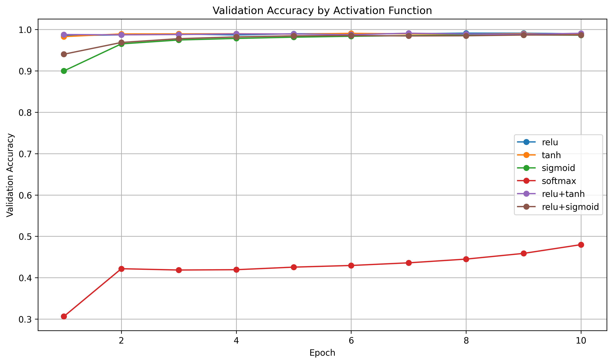
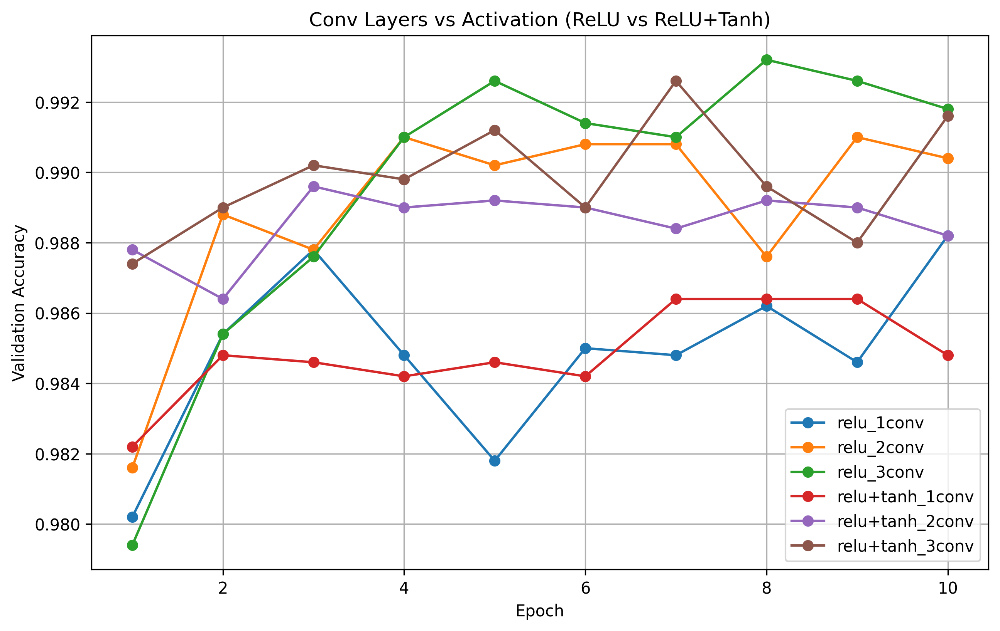
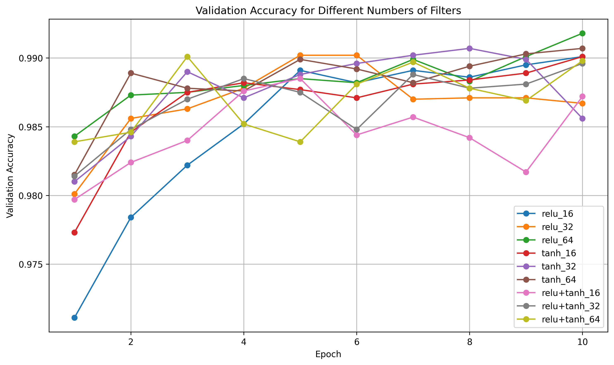
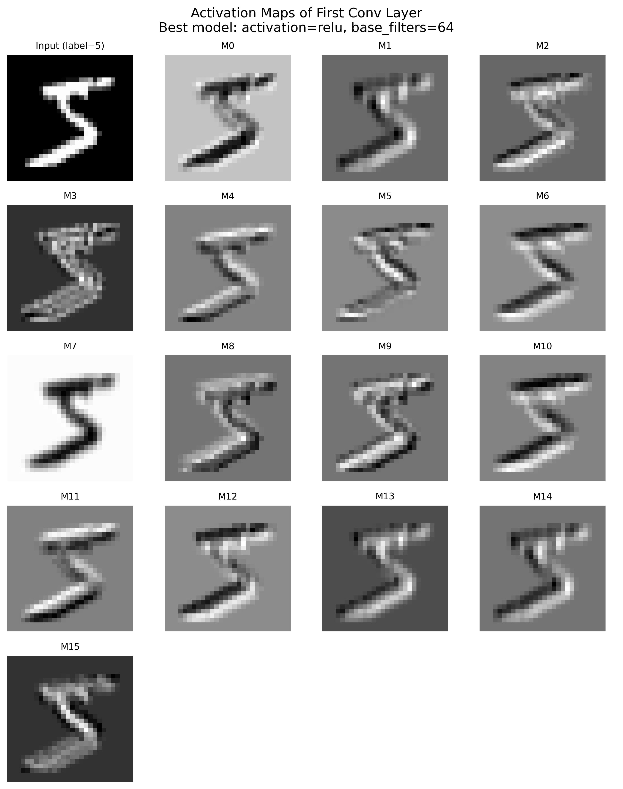
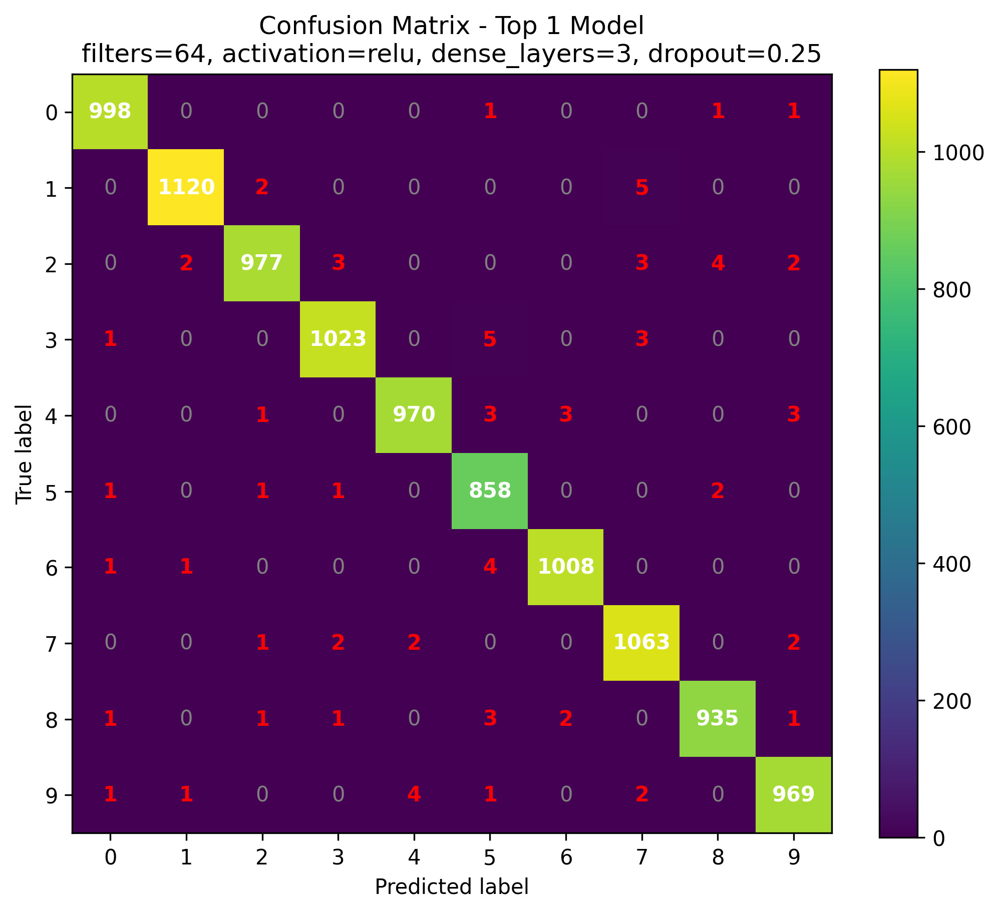
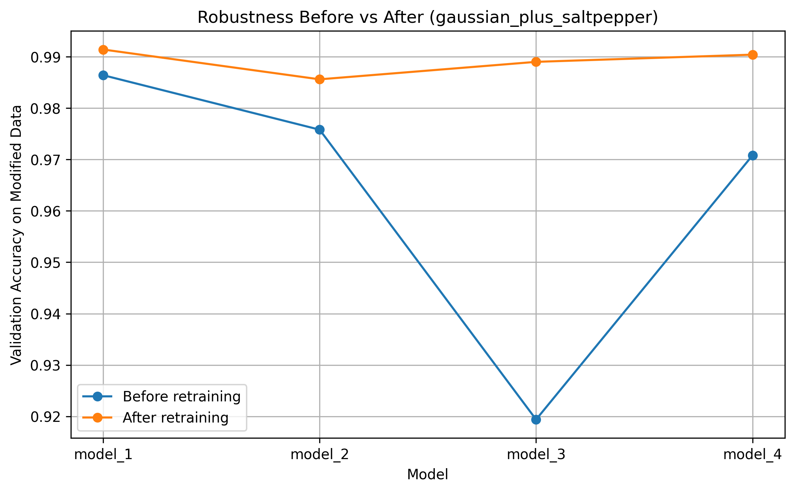

# Handwritten Digit Recognition with Convolutional Neural Networks (CNNs)

Artificial Intelligence project developed as part of the KI1 course in the M.Sc. Data Science program at Justus Liebig University Giessen.

The objective of this project was not only to build a Convolutional Neural Network (CNN) for handwritten digit recognition on the MNIST dataset, but also to systematically investigate how architectural choices, regularization techniques and training strategies influence model performance, generalization ability and robustness.

My work focused primarily on hyperparameter optimization, CNN architecture analysis, regularization techniques, feature extraction, optimizer comparison and robustness evaluation on modified datasets.

## Project Overview

This project explores the complete development cycle of a CNN model, from architecture design and hyperparameter optimization to robustness evaluation and retraining strategies.

The goal was to improve classification performance while maintaining a reasonable balance between predictive accuracy, model complexity and generalization capability.

## Research Questions

- Which activation functions perform best for handwritten digit recognition?
- Does increasing CNN depth improve feature extraction and classification accuracy?
- How does the number of filters influence model capacity?
- What is the impact of dropout regularization?
- Can Batch Normalization improve model performance?
- Which optimizer performs better: Adam or SGD?
- How robust are CNN models against image perturbations?
- Can retraining improve robustness on modified datasets?

## Dataset

The project uses the MNIST handwritten digit dataset.

- 70,000 grayscale images
- Image size: 28 × 28 pixels
- 10 digit classes (0–9)
- Standard benchmark dataset for image classification

## My Contributions

This project was conducted as part of a collaborative university assignment.

My individual research focused on the systematic optimization and evaluation of CNN architectures.

- Evaluation of activation functions (ReLU, Tanh, Sigmoid, Softmax and hybrid combinations)
- Analysis of CNN depth through convolutional block experiments
- Filter configuration optimization and feature extraction analysis
- Activation map visualization and interpretation
- Large-scale hyperparameter optimization using Grid Search
- Hyperparameter search with Keras Tuner
- Dropout regularization analysis
- Batch Normalization evaluation
- Batch Size experiments
- Dense Layer capacity analysis
- Optimizer comparison (Adam vs SGD)
- Validation on multiple modified datasets
- Robustness evaluation under noise, occlusion, rotation and image perturbations
- Retraining experiments for robustness improvement
- Final evaluation on unseen test data

## Technologies

- Python
- TensorFlow
- Keras
- Keras Tuner
- NumPy
- Pandas
- Matplotlib
- Jupyter Notebook

## Methodology

### CNN Architecture Optimization

Different CNN architectures were evaluated by varying:

- Activation Functions
- Number of Convolutional Layers
- Number of Filters
- Number of Dense Layers

The objective was to determine which architectural choices provide the best trade-off between model complexity and classification performance.

### Hyperparameter Optimization

Several hyperparameters were investigated:

- Learning Rate
- Dropout Rate
- Dense Units
- Batch Size
- Optimizer Selection

Both Grid Search and Keras Tuner were used to identify high-performing configurations.

### Model Interpretation

To better understand feature extraction inside the network, the following analyses were performed:

- Activation Maps
- Feature Maps
- Convolution Filter Visualization
- Confusion Matrix Analysis

### Robustness Evaluation

The best-performing models were evaluated on modified datasets containing:

- Gaussian Noise
- Salt-and-Pepper Noise
- Rotation
- Occlusion
- Shift Transformations
- Speckle Noise

### Retraining Experiments

Selected models were retrained using mixtures of original and modified datasets in order to improve robustness and generalization performance.

## Visualizations

### Activation Functions

**Description:** Comparison of different activation functions during CNN training.

**Key Finding:** ReLU-based architectures achieved the highest validation accuracy and the most stable convergence behavior.
 

### Convolutional Layers

**Description:** Evaluation of the impact of network depth on classification performance.

**Key Finding:** Increasing the number of convolutional layers improved feature extraction and overall model accuracy.
 

### Filter Configuration
**Description:** Comparison of different filter configurations.

**Key Finding:** Larger filter configurations improved feature extraction capabilities and produced the strongest validation performance.
 

### Activation Maps

**Description:** Visualization of learned feature maps within the CNN.

**Key Finding:** Early layers captured simple visual structures while deeper layers encoded increasingly complex digit representations.
 

### Confusion Matrix

**Description:** Confusion matrix of the best-performing CNN model.

**Key Finding:** Most handwritten digits were classified correctly, with only minor confusion between visually similar classes.
 

### Robustness Evaluation

**Description:** Evaluation of model robustness under noisy input conditions.

**Key Finding:** Retraining significantly improved robustness and prediction confidence under noisy conditions.
 

## Key Findings

- ReLU-based architectures consistently achieved the strongest performance.
- Deeper CNN architectures improved feature extraction capabilities.
- Larger filter configurations produced better classification results.
- Moderate dropout values improved generalization.
- Adam outperformed SGD on validation performance.
- Batch Normalization showed limited impact in this specific setting.
- Occlusion produced the strongest degradation in performance.
- Retraining substantially improved robustness on perturbed datasets.

## Full Report

The complete project documentation, including all experiments, hyperparameter optimization results, robustness evaluations and model comparisons, is available here:

 
    
